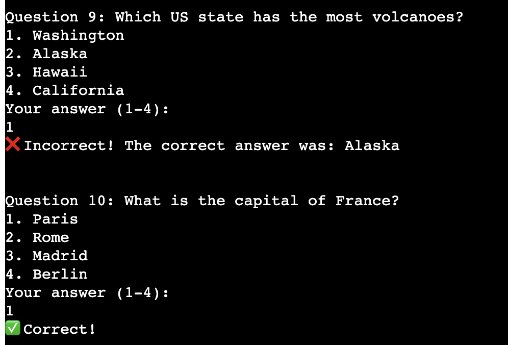
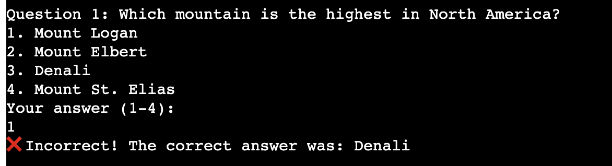

# [AcademIQ](https://academ-iq-b9bb24eb3c99.herokuapp.com)

Developer: Radwan Duadu ([RadwanDuadu](https://www.github.com/RadwanDuadu))

AcademIQ is a terminal-based quiz application built with Python, designed to make learning interactive and engaging. It covers five key academic subjects — Geography, History, Biology, Chemistry, and Physics — offering users a selection of randomized multiple-choice questions. The game provides immediate feedback on answers, tracks performance, and allows users to replay with different topics, making it ideal for revision, exam prep, or general knowledge testing.

Targeted at students, educators, and lifelong learners, AcademIQ delivers a lightweight and accessible learning tool that works directly from the command line. With robust input validation, a replayable structure, and a focus on ease-of-use, the application is perfect for anyone seeking to improve subject knowledge in a fun and self-paced way.

source: [AcademIQ amiresponsive](https://ui.dev/amiresponsive?url=https://academ-iq-b9bb24eb3c99.herokuapp.com)

## UX

### The 5 Planes of UX

#### 1. Strategy

**Purpose**
- Provide users with a simple and interactive way to test their knowledge across multiple academic subjects.
- Help users identify strengths and areas for improvement through engaging quiz sessions.

**Primary User Needs**
- Select a topic and complete a short, randomized quiz with immediate feedback.
- View a summary of correct and incorrect answers at the end of each session.
- Replay quizzes on different topics to reinforce learning.

**Business Goals**
- Offer a reliable, user-friendly educational tool that promotes self-assessment and continuous learning.
- Support students, educators, and independent learners in strengthening their academic knowledge efficiently.

#### 2. Scope

**[Features](#features)** (see below)

**Content Requirements**
- Input system for selecting a quiz topic from multiple academic categories.
- Randomized display of multiple-choice questions with numbered answer options.
- Score tracking for correct and incorrect answers during a single quiz session.
- End-of-quiz summary displaying total questions attempted, number correct, and incorrect.
- Option to restart the quiz and choose a new topic for repeated learning.

#### 3. Structure

**Information Architecture**
- **Hierarchy**:
  - Topic selection and quiz initiation as the primary focus for ease of access.

**User Flow**
1. User opens the app → selects a quiz topic from the available list.
2. User answers a series of randomized multiple-choice questions.
3. User receives immediate feedback after each question (correct/incorrect).
4. User completes the quiz → views a summary of their score and performance.
5. User chooses to replay with a new topic or exit the application.

#### 4. Skeleton

**[Data Models](#Flowchart)** (see below)

#### 5. Surface

**Visual Design Elements**
- No visual design elements as this project is completed using the commandline. 

## User Stories

| **Target** | **Expectation**                                                                 | **Outcome**                                                                   |
| ---------- | ------------------------------------------------------------------------------- | ----------------------------------------------------------------------------- |
| As a user  | I would like to answer multiple-choice questions using a number between 1 and 4 | so that I can easily select an option without typing the full answer.         |
| As a user  | I want the quiz to validate my input                                            | so that I don't accidentally crash the program by entering something invalid. |
| As a user  | I want the quiz to ignore capitalization when checking my answers               | so that I’m not penalized for formatting.                                     |
| As a user  | I want immediate feedback after each question                                   | so that I know right away whether I was correct or not.                       |
| As a user  | I want to see my total score at the end of the quiz                             | so that I can track how well I performed.                                     |
| As a user  | I want the option to restart the quiz without closing the program               | so that I can try different topics easily.                                    |
| As a user  | I want the quiz to only accept “yes” or “no” when asking to restart             | so that I’m not confused by vague input handling.                             |
| As a user  | I want to choose from multiple quiz topics                                      | so that I can focus on the subject areas that interest me most.               |
| As a user  | I want questions to be randomly selected from the topic I choose                | so that I get a different experience each time I play.                        |
| As a developer | I want to deploy the quiz application on Heroku            | so that users can access and play the game online without needing to install anything locally. |
| As a developer | I want to validate the Python code using tools like CI Python Linter | so that I can ensure code quality, readability, and consistency with PEP 8 standards.          |

## Features

### Existing Features

| **Feature**                | **Notes**                                                                                                              | **Screenshot**                                               |
| -------------------------- | ---------------------------------------------------------------------------------------------------------------------- | ------------------------------------------------------------ |
| Multiple-Choice Questions  | Each question is presented with 4 answer choices, and users respond by entering a number (1–4).                        |     |
| Input Validation (Answers) | The quiz validates user input to ensure only numbers between 1 and 4 are accepted to prevent invalid entries.          |    |
| Case-Insensitive Answers   | User answers are checked without considering case, ensuring fairness regardless of capitalization.                     |    |
| Answer Feedback            | The quiz provides immediate feedback after each question—indicating correct or incorrect and showing the right answer. |            |
| Score Tracking             | Tracks total, correct, and incorrect answers throughout the session, showing a final summary.                          |      |
| Restart Quiz Option        | At the end of the quiz, users can restart without needing to manually rerun the application.                           |      |
| Restart Input Validation   | Only accepts “yes” or “no” inputs when asking users if they want to restart the quiz.                                  |  |
| Topic Selection            | Users can choose from five available topics before the quiz starts (e.g., Geography, History, etc.).                   |     |
| Random Question Selection  | The quiz randomly selects and shuffles questions from the chosen topic to offer a unique experience each time.         |    |

### Future Features

| **Feature**                         | **Description**                                                                                                                                                    |
| ----------------------------------- | ------------------------------------------------------------------------------------------------------------------------------------------------------------------ |
| **User-Contributed Questions**      | Allow users to input their own multiple-choice questions, including four options and the correct answer, which are then validated and added to the relevant topic. |
| **High Score Tracking**             | Track and display the user’s highest score across all sessions, providing motivation to improve and recognize personal achievements.                               |
| **Timed Quiz Mode**                 | Introduce an optional mode where each question must be answered within a set time limit, increasing challenge and simulating time-pressured conditions.            |
| **Detailed Quiz Summary**           | Display a complete breakdown of all quiz questions, showing which were answered correctly and incorrectly, along with the correct answers for review.              |
| **Custom Question Count Selection** | Allow users to choose how many questions they wish to answer before starting the quiz, enabling flexible gameplay sessions of varying lengths.                     |

## Tools & Technologies

| Tool / Tech | Use |
| --- | --- |
|  | Generate README and TESTING templates. |
|  | Version control. (`git add`, `git commit`, `git push`) |
|  | Secure online code storage. |
|  | Local IDE for development. |
|  | Back-end programming language. |
|  | Hosting the deployed back-end site. |
|  | Help debug, troubleshoot, and explain things. |
|  | Flow diagrams for mapping the app's logic. |
| [](https://mermaid.live/edit#pako:eNqtVE1z2jAQ_SsanZIZkjEBEupDOw0kgXwnJJ1pDQfFWrAmtuRKcihh-O_VlxmT9tBDfcCWtO_te7uL1jgVFHCM57lYphmRGj0NpxyZ5-teMtFmY7aPDg4-o9NkXJTCnP-s2Lv5AaWZ4AoRTpECjVQqJKA3kpsTpAV6BylmnunUEQySR3Awc1qyFKWZYCmEkIELGa7HBpsBokQTVErxxihQS8rol42PHJpIdCtc_FlyLxnXRgMCKYVEBShFFmDza5AF4yS335SptFIKLTOiETNvKfgCLZnOXKag4czLbKT5bqzYvfNkkAmhAFUK5IGCHFJtdDkfAXzuAi-SiTtE7ahRorkUhbNlLCvgwb80lRNFvgoEF45gtHY1R7kQpZHLcmjwZOQNEBfGb56jFzBMxliZkxXQUJyRIxknQ7-_xXoJdUb0Vwdjh73cYglXS5BIlC55CLp0QVfbVtqC2Ap7RtuIHVhAXTnU9T9097rR3Zv_2t0br7yRpu7ubTIQRUnM9FpxzhHjZaU9hRlr6a1ZX4Hs1gHvrCEfGqJqG3dN_vtkzFMJBXD9gc3_XWYNTLD-0IAw_gdIMvKS17h7h3jc9m0OQF9I-hqOH_yxXzy6xWQ9spNkp2hnTndHqvYyaegaNbZqe0_bzP4KIHPTHEf-YXIdvfcANKh7chTP6515YnPbiZWpv8psg1PBNeOV74-9foKy56aMQWMvqP22l5xxOtufctzCC8kojrWsoIULMz3ELvHaoqbYEBcwxbH5pES-TvGUbwymJPyHEEUNk6JaZDiek1yZVVWa6YIhIwtJtiGk0mKy4ukWApyCHIiKaxx3IkeJ4zX-ZVb9_uGnqNeJOr2jk067Gx238ArH3ePDk14UHbW7x-1eu91tb1r43YmIDvsnvRYGyrSQN_7adrf35jckPNsC) | Flow diagrams for mapping the app's logic. |

## Database Design

### Data Model

#### Flowchart

To follow best practice, a flowchart was created for the app's logic, and mapped out using a free version of [Lucidchart](https://www.lucidchart.com/pages/ER-diagram-symbols-and-meaning). The flowchart below represents the main process of this Python program. It shows the entire cycle of the application.

Source: [Mermaid Flowchart for AcademIQ](https://mermaid.live/edit#pako:eNqtVE1z2jAQ_SsanZoZksHhI-BDOw0kgXwnJJ1pDQfFWrAmtuRKcihh-O_VF4xJe-ihPoAl7Xv73u5aa5wKCjjG81ws04xIjZ6GU47M8_VTMtFmY3aADg8_o9NkXJTCnP-s2Lv5AaWZ4AoRTpECjVQqJKA3kpsTpAV6BylmnunUEQySR3Awc1qyFKWZYCmEkIELGa7HBpsBokQTVErxxihQS8rol42PHJpIdCtc_FlyLxnXRgMCKYVEBShFFmDza5AF4yS375SptFIKLTOiETP_UvAFWjKduUxBw5mXWUvz3Vixe-fJIBNCAaoUyEMFOaTa6HI-AvjcBV4kE3eIomatRHMpCmfLWFbAg39pKieKfBUILhzBaO1qjnIhSiOX5VDjycgbIC6M3zxHL2CYjLEyJyugoTgjRzJOhn5_h_USthnRXx2MHfZyhyVcLUEiUbrkIejSBV3tWmkLYivsGW0j9mABdeVQ1__Q3etad2_-a3dvvPJamm13b5OBKEpipteKc44YLyvtKcxYS2_N-gpktw54Zw350BC1tXFX579PxjyVUADXH9j85zKrYYL1hxqE8T9AkpGXfIu7d4jHXd_mAPSFpK_h-MEf-8WjW0zWIztJdor25nR_pLZeJjVdo9rW1t7TLrO_AsjcNMeRf5hcR-89AA3qnhzF83pvntjcdmJl6q8y2-BUcM145ftjr5-g7LkuY1DbC2q_fUrOOJ0dTDlu4IVkFMdaVtDAhZkeYpd4bVFTbIgLmOLYvFIiX6d4yjcGUxL-Q4hiC5OiWmQ4npNcmVVVmumCISMLSYrdLqm0mKx4usMApyAHouIax512z5HieI1_4bjV6x31m51Ws9U5PmlF7Wa3gVc4bnePTjrN5nHU7kadKGpHmwZ-dzKaR72Tdt88vW7UivpRp9_AQJkW8sbf4u4y3_wG8njeSQ)

#### Classes & Functions

The primary functions used on this application are:

- `get_random_questions_with_shuffled_options()`
    - Randomly selects a specified number of questions from the provided list.
- `topic_choice()`
    - Selects the subject based on user input and validates input.
- `reset_game()`
    - Resets the game state to start of user flow. 
- `score_tracker()`
    - Track correct and incorrect answers and total score.
- `quiz_banner()`
    - Displays the ASCII art banner for the quiz game.
- `input_validation()`
    - Validates user input against a list of valid inputs.
- `clear()`
    - Clear the text on the screen. 
- `run_game()`
    - Main function to run the quiz game.
- `main()`
    - Runs the run_game() function

#### Imports

I've used the following Python packages and external imports.

- `questions`: used to get the list of subject questions.
- `random`: used to get a random choice from a list.
- `time`: used to add time delays between display questions.
- `colorama`: used to change the colour of commandline text.

## Agile Development Process

### GitHub Projects

[GitHub Projects](https://www.github.com/RadwanDuadu/AcademIQ/projects) served as an Agile tool for this project. Through it, EPICs, User Stories, issues/bugs, and Milestone tasks were planned, then subsequently tracked on a regular basis using the Kanban project board.

### GitHub Issues

[GitHub Issues](https://www.github.com/RadwanDuadu/AcademIQ/issues) served as an another Agile tool. There, I managed my User Stories and Milestone tasks, and tracked any issues/bugs.

| Link | Screenshot |
| --- | --- |
|  |  |
|  |  |

### MoSCoW Prioritization

I've decomposed my Epics into User Stories for prioritizing and implementing them. Using this approach, I was able to apply "MoSCoW" prioritization and labels to my User Stories within the Issues tab.

- **Must Have**: guaranteed to be delivered - required to Pass the project (*max ~60% of stories*)
- **Should Have**: adds significant value, but not vital (*~20% of stories*)
- **Could Have**: has small impact if left out (*the rest ~20% of stories*)
- **Won't Have**: not a priority for this iteration - future features

## Testing

> [!NOTE]
> For all testing, please refer to the [TESTING.md](TESTING.md) file.

## Deployment

Code Institute has provided a [template](https://github.com/Code-Institute-Org/python-essentials-template) to display the terminal view of this backend application in a modern web browser. This is to improve the accessibility of the project to others.

The live deployed application can be found deployed on [Heroku](https://academ-iq-b9bb24eb3c99.herokuapp.com).

### Heroku Deployment

This project uses [Heroku](https://www.heroku.com), a platform as a service (PaaS) that enables developers to build, run, and operate applications entirely in the cloud.

Deployment steps are as follows, after account setup:

- Select **New** in the top-right corner of your Heroku Dashboard, and select **Create new app** from the dropdown menu.
- Your app name must be unique, and then choose a region closest to you (EU or USA), then finally, click **Create App**.
- From the new app **Settings**, click **Reveal Config Vars**, and set the value of **KEY** to `PORT`, and the **VALUE** to `8000` then select **ADD**.
- Further down, to support dependencies, select **Add Buildpack**.
- The order of the buildpacks is important; select `Python` first, then `Node.js` second. (if they are not in this order, you can drag them to rearrange them)

Heroku needs some additional files in order to deploy properly.

- [requirements.txt](requirements.txt)
- [Procfile](Procfile)
- [.python-version](.python-version)

You can install this project's **[requirements.txt](requirements.txt)** (*where applicable*) using:

- `pip3 install -r requirements.txt`

If you have your own packages that have been installed, then the requirements file needs updated using:

- `pip3 freeze --local > requirements.txt`

The **[Procfile](Procfile)** can be created with the following command:

- `echo web: node index.js > Procfile`

The **[.python-version](.python-version)** file tells Heroku the specific version of Python to use when running your application.

- `3.12` (or similar)

For Heroku deployment, follow these steps to connect your own GitHub repository to the newly created app:

Either (*recommended*):

- Select **Automatic Deployment** from the Heroku app.

Or:

- In the Terminal/CLI, connect to Heroku using this command: `heroku login -i`
- Set the remote for Heroku: `heroku git:remote -a app_name` (*replace `app_name` with your app name*)
- After performing the standard Git `add`, `commit`, and `push` to GitHub, you can now type:
	- `git push heroku main`

The Python terminal window should now be connected and deployed to Heroku!

### Local Development

This project can be cloned or forked in order to make a local copy on your own system.

For either method, you will need to install any applicable packages found within the [requirements.txt](requirements.txt) file.

- `pip3 install -r requirements.txt`.

#### Cloning

You can clone the repository by following these steps:

1. Go to the [GitHub repository](https://www.github.com/RadwanDuadu/AcademIQ).
2. Locate and click on the green "Code" button at the very top, above the commits and files.
3. Select whether you prefer to clone using "HTTPS", "SSH", or "GitHub CLI", and click the "copy" button to copy the URL to your clipboard.
4. Open "Git Bash" or "Terminal".
5. Change the current working directory to the location where you want the cloned directory.
6. In your IDE Terminal, type the following command to clone the repository:
	- `git clone https://www.github.com/RadwanDuadu/AcademIQ.git`
7. Press "Enter" to create your local clone.

Alternatively, if using Gitpod, you can click below to create your own workspace using this repository.

**Please Note**: in order to directly open the project in Gitpod, you should have the browser extension installed. A tutorial on how to do that can be found [here](https://www.gitpod.io/docs/configure/user-settings/browser-extension).

#### Forking

By forking the GitHub Repository, you make a copy of the original repository on our GitHub account to view and/or make changes without affecting the original owner's repository. You can fork this repository by using the following steps:

1. Log in to GitHub and locate the [GitHub Repository](https://www.github.com/RadwanDuadu/AcademIQ).
2. At the top of the Repository, just below the "Settings" button on the menu, locate and click the "Fork" Button.
3. Once clicked, you should now have a copy of the original repository in your own GitHub account!

### Local VS Deployment

There are no remaining major differences between the local version when compared to the deployed version online.

## Credits

### Content

| Source | Notes |
| --- | --- |
| [Markdown Builder](https://markdown.2bn.dev) | Help generating Markdown files |
| [Love Sandwiches](https://codeinstitute.net) | Code Institute walkthrough project inspiration |
| [Real Python](https://realpython.com/python-quiz-application) | Inspiration for a quiz app |
| [StackOverflow](https://stackoverflow.com/a/50921841) | Clear screen in Python |
| [Colorama](https://www.youtube.com/watch?v=u51Zjlnui4Y) | Adding color in Python |
| [ChatGPT](https://chatgpt.com) | Help with code logic and explanations |

### Media

| Source | Notes |
| --- | --- |
| [ASCII Art Archive](https://www.asciiart.eu) | Pre-defined ASCII art |

### Acknowledgements

- I would like to thank my Code Institute mentor, [Tim Nelson](https://www.github.com/TravelTimN) for the support throughout the development of this project.
- I would like to thank the [Code Institute](https://codeinstitute.net) Tutor Team for their assistance with troubleshooting and debugging some project issues.
- I would like to thank the [Code Institute Slack community](https://code-institute-room.slack.com) for the moral support; it kept me going during periods of self doubt and impostor syndrome.

