# Testing

> [!NOTE]
> Return back to the [README.md](README.md) file.

## Code Validation

### Python

I have used the recommended [PEP8 CI Python Linter](https://pep8ci.herokuapp.com) to validate all of my Python files.

| Directory | File | URL | Screenshot | Notes |
| --- | --- | --- | --- | --- |
|  | [questions.py](https://github.com/RadwanDuadu/AcademIQ/blob/main/questions.py) | [PEP8 CI Link](https://pep8ci.herokuapp.com/https://raw.githubusercontent.com/RadwanDuadu/AcademIQ/main/questions.py) | 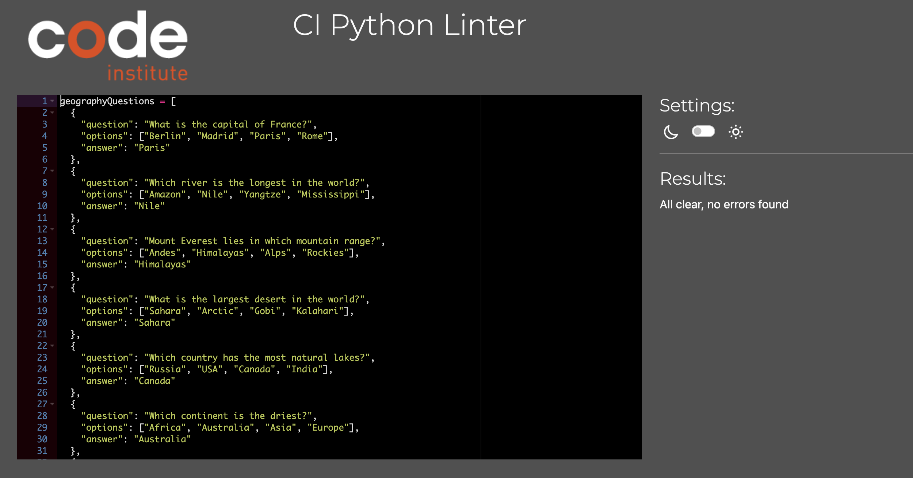 | No Errors |
|  | [run.py](https://github.com/RadwanDuadu/AcademIQ/blob/main/run.py) | [PEP8 CI Link](https://pep8ci.herokuapp.com/https://raw.githubusercontent.com/RadwanDuadu/AcademIQ/main/run.py) | 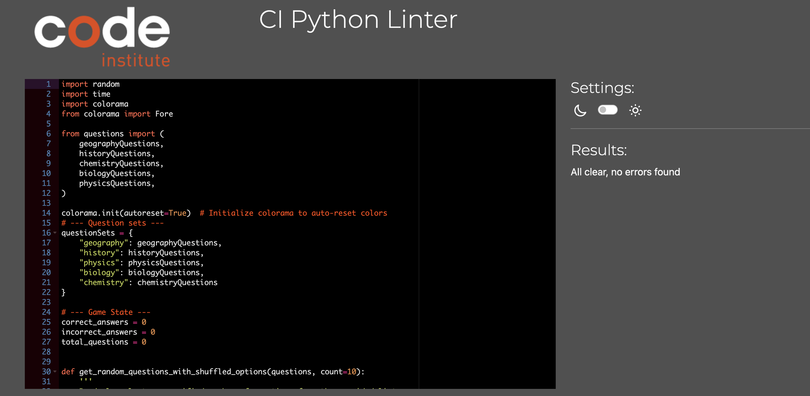 | No Errors |

## Responsiveness

I've tested my deployed project to check for responsiveness issues.

| Mobile | Tablet | Desktop | Notes |
| --- | --- | --- | --- |
| 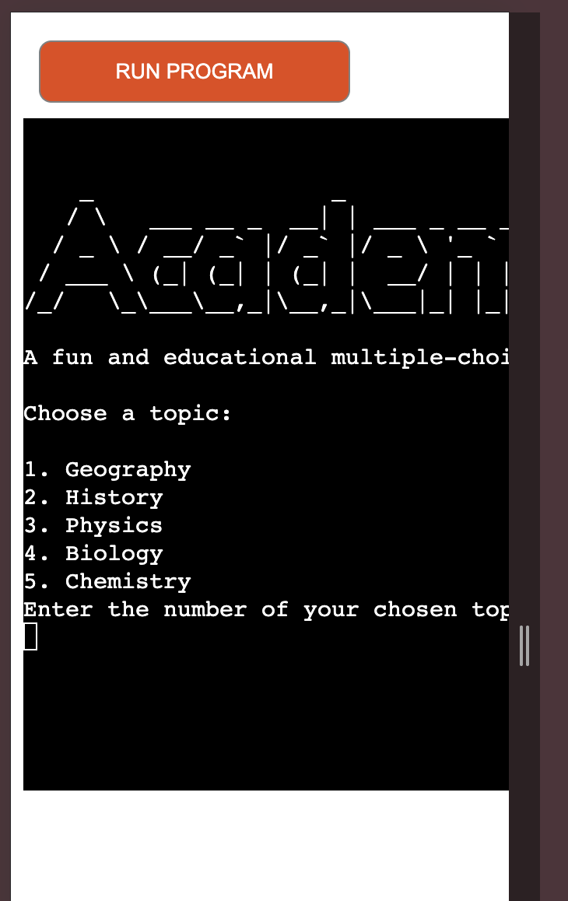 | 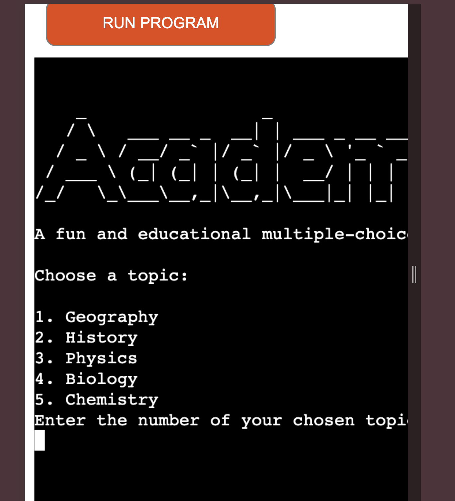 | 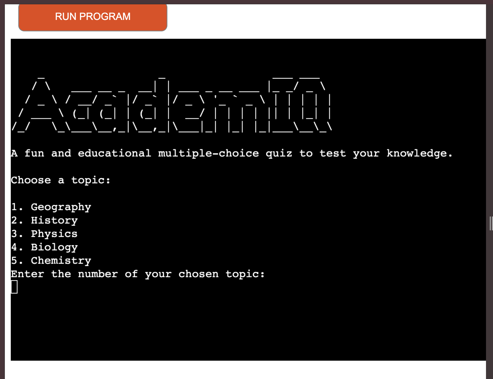 | Mobile issues: `overflow-x`, doesn't work on iPhones, but does work on Android with some limitations |

## Browser Compatibility

I've tested my deployed project on multiple browsers to check for compatibility issues.

| Chrome | Firefox | Safari | Notes |
| --- | --- | --- | --- |
| 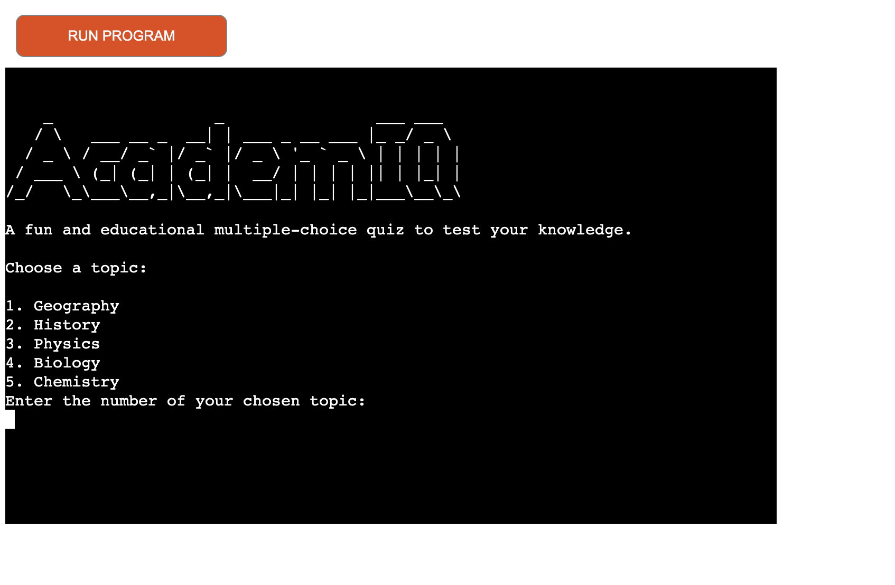 | 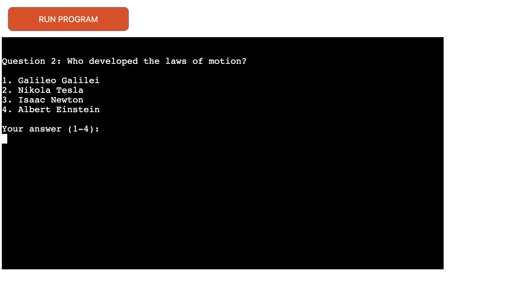 | 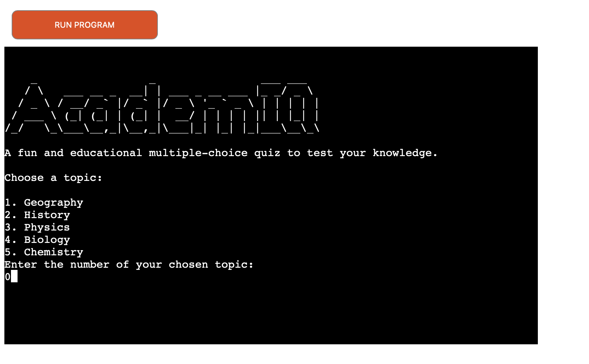 | Chrome: work as expected. Firefox: emojis get cut-off. Safari: some limitations. |

## Lighthouse Audit

I've tested my deployed project using the Lighthouse Audit tool to check for any major issues. Some warnings are outside of my control, and mobile results tend to be lower than desktop.

| Mobile | Desktop |
| --- | --- |
| 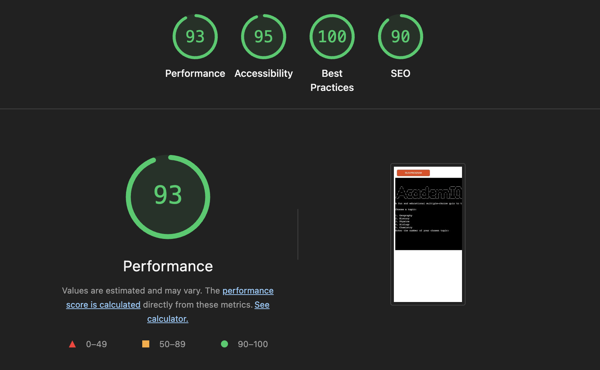 | 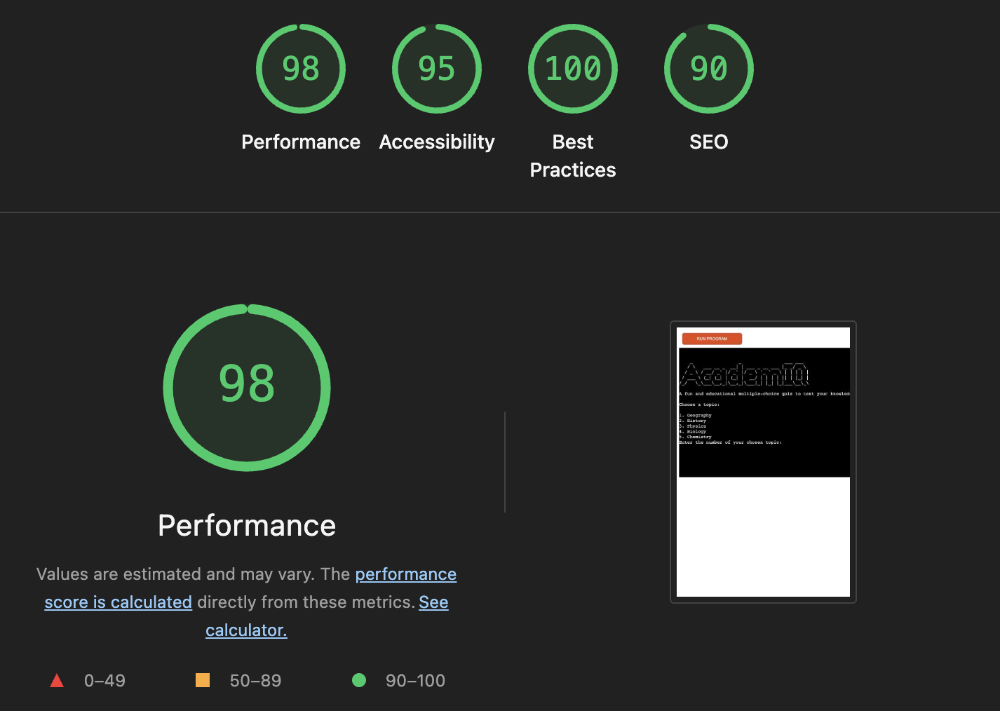 |

## Defensive Programming

Defensive programming was manually tested with the below user acceptance testing:

| **Feature**   | **Expectation**   | **Test**    | **Result**    | **Screenshot**    |
| ------------- | ------------------| ----------- | --------------| ----------------- |
| Topic Selection Validation   | The game should only allow users to choose from available topics using a valid number. | Entered invalid input such as letters and out-of-range numbers.                 | Program displayed error messages and re-prompted until valid input was received. |     |
| Answer Input Handling        | Only numeric values from 1 to 4 should be accepted during answer selection.            | Entered invalid responses like letters, empty strings, and numbers outside 1–4. | The program rejected invalid input and prompted again without crashing.          | 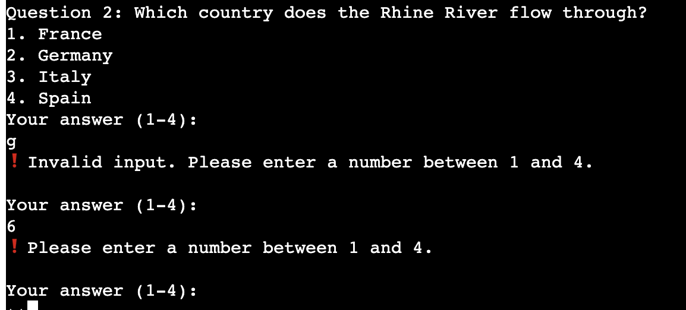        |
| Score Calculation Safety     | The program should not crash due to missing answer fields or incorrect indices.        | Entered random invalid options and forced incorrect questions.                  | Program handled all cases gracefully and tracked scores accurately.              | 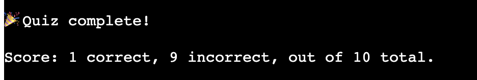      |
| Restart Prompt Handling      | Only “yes” or “no” should be accepted when asking to restart the quiz.                 | Typed “y”, “maybe”, and random strings.                                         | Program rejected invalid input and prompted again clearly.                       | 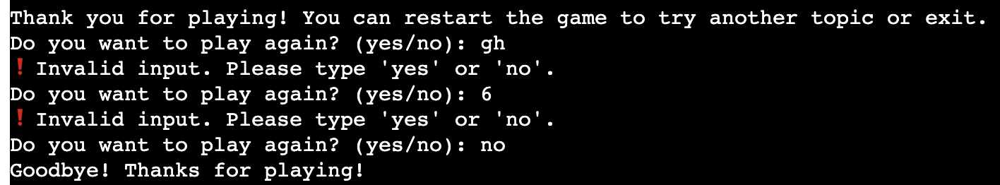  |
| Empty Question Bank Handling | The app should exit gracefully if a topic has no valid questions.                      | Emptied one question bank and ran the game.                                     | Game detected the issue and exited with a friendly error message.                |  |
| Clear Instructions           | The app should provide clear instructions for each step.                               | Ran through the game without reading the source code.                           | All prompts and feedback were understandable without needing documentation.      | 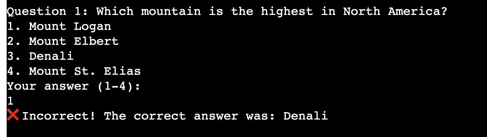           |

## User Story Testing

| **Target**     | **Expectation**                                                                 | **Outcome**                                                                                    | **Screenshot**                                      |
| -------------- | ------------------------------------------------------------------------------- | ---------------------------------------------------------------------------------------------- | --------------------------------------------------- |
| As a user      | I would like to answer multiple-choice questions using a number between 1 and 4 | so that I can easily select an option without typing the full answer.                          |  |
| As a user      | I want the quiz to validate my input                                            | so that I don't accidentally crash the program by entering something invalid.                  |  |
| As a user      | I want the quiz to ignore capitalization when checking my answers               | so that I’m not penalized for formatting.                                                      | 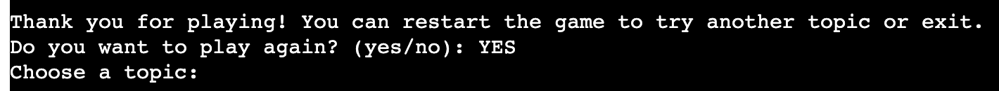 |
| As a user      | I want immediate feedback after each question                                   | so that I know right away whether I was correct or not.                                        | 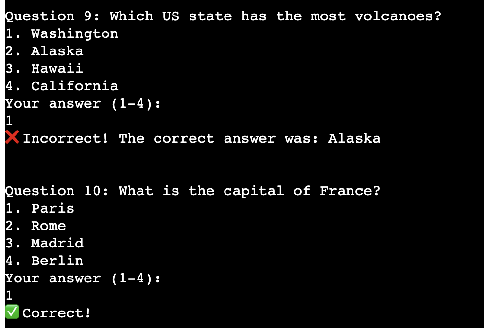 |
| As a user      | I want to see my total score at the end of the quiz                             | so that I can track how well I performed.                                                      |  |
| As a user      | I want the option to restart the quiz without closing the program               | so that I can try different topics easily.                                                     |  |
| As a user      | I want the quiz to only accept “yes” or “no” when asking to restart             | so that I’m not confused by vague input handling.                                              |  |
| As a user      | I want to choose from multiple quiz topics                                      | so that I can focus on the subject areas that interest me most.                                | 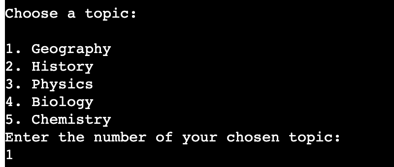 |
| As a user      | I want questions to be randomly selected from the topic I choose                | so that I get a different experience each time I play.                                         | 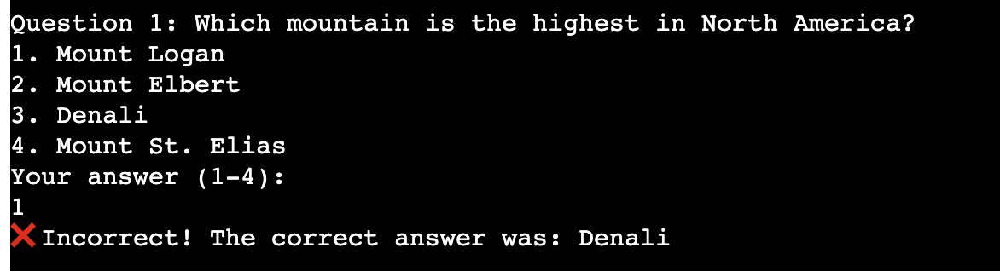 |

## Bugs

⚠️ INSTRUCTIONS ⚠️

Nobody likes bugs,... except the assessors! Projects seem more suspicious if a student doesn't properly track their bugs. If you're about to submit your project without any bugs listed below, you should ask yourself why you're doing this course in the first place, if you're able to build this entire application without running into any bugs. The best thing you can do for any project is to document your bugs! Not only does it show the true stages of development, but think of it as breadcrumbs for yourself in the future, should you encounter the same/similar bug again, it acts as a gentle reminder on what you did to fix the bug.

If/when you encounter bugs during the development stages of your project, you should document them here, ideally with a screenshot explaining what the issue was, and what you did to fix the bug.

Alternatively, an improved way to manage bugs is to use the built-in **[Issues](https://www.github.com/RadwanDuadu/AcademIQ/issues)** tracker on your GitHub repository. This can be found at the top of your repository, the tab called "Issues".

If using the Issues tracker for bug management, you can simplify the documentation process for testing. Issues allow you to directly paste screenshots into the issue page without having to first save the screenshot locally. You can add labels to your issues (e.g. `bug`), assign yourself as the owner, and add comments/updates as you progress with fixing the issue(s). Once you've solved the issue/bug, you should then "Close" it.

When showcasing your bug tracking for assessment, you can use the following examples below.

⚠️ --- END --- ⚠️

### Fixed Bugs

I've used [GitHub Issues](https://www.github.com/RadwanDuadu/AcademIQ/issues) to track and manage bugs and issues during the development stages of my project.

All previously closed/fixed bugs can be tracked [here](https://www.github.com/RadwanDuadu/AcademIQ/issues?q=is%3Aissue+is%3Aclosed+label%3Abug).

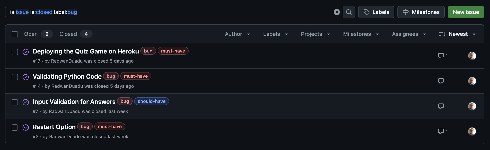

### Unfixed Bugs

⚠️ INSTRUCTIONS ⚠️

You will need to mention any unfixed bugs and why they are not fixed upon submission of your project. This section should include shortcomings of the frameworks or technologies used. Although time can be a big variable to consider, paucity of time and difficulty understanding implementation is not a valid reason to leave bugs unfixed. Where possible, you must fix all outstanding bugs, unless outside of your control.

If you've identified any unfixed bugs, no matter how small, be sure to list them here! It's better to be honest and list them, because if it's not documented and an assessor finds the issue, they need to know whether or not you're aware of them as well, and why you've not corrected/fixed them.

⚠️ --- END --- ⚠️

Any remaining open issues can be tracked [here](https://www.github.com/RadwanDuadu/AcademIQ/issues).

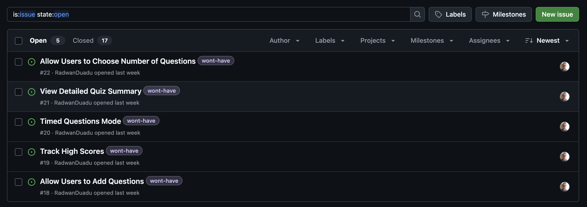

### Known Issues

| Issue | Screenshot |
| --- | --- |
| When using a helper `clear()` function, any text above the height of the terminal (24 lines) does not clear, and remains when scrolling up. |  |
| The `colorama` terminal colors are fainter on Heroku when compared to the IDE locally. | 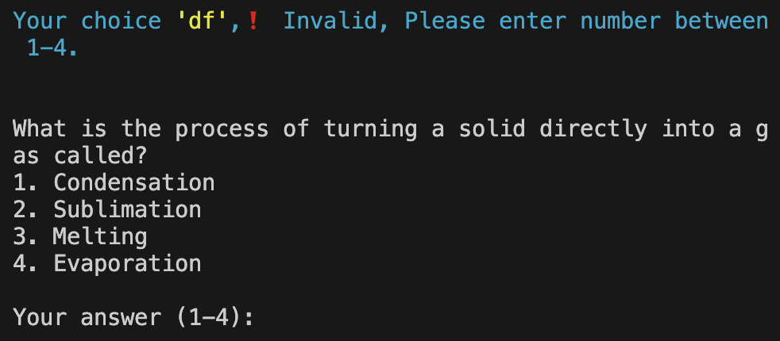 |
| Emojis are cut-off when viewing the application from Firefox. |  |
| The Python terminal doesn't work well with Safari, and sometimes uses cannot type in the application. |  |
| If a user types `CTRL`+`C` in the terminal on the live site, they can manually stop the application and receive and error. | 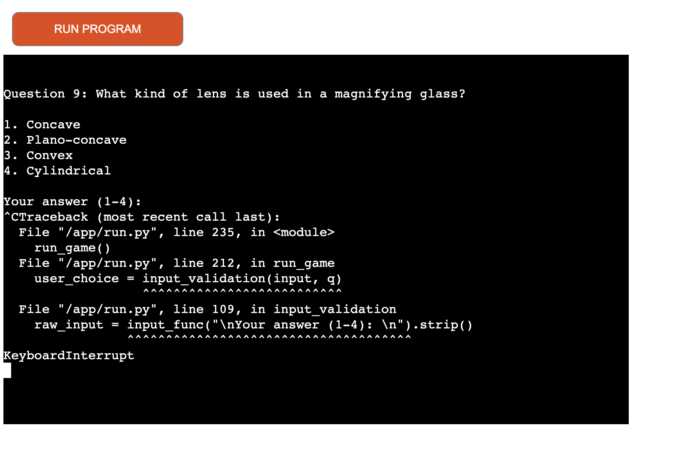 |

> [!IMPORTANT]
> There are no remaining bugs that I am aware of, though, even after thorough testing, I cannot rule out the possibility.

